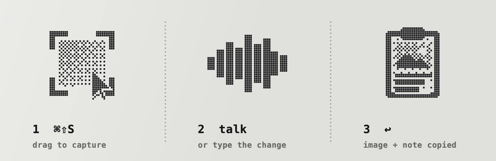
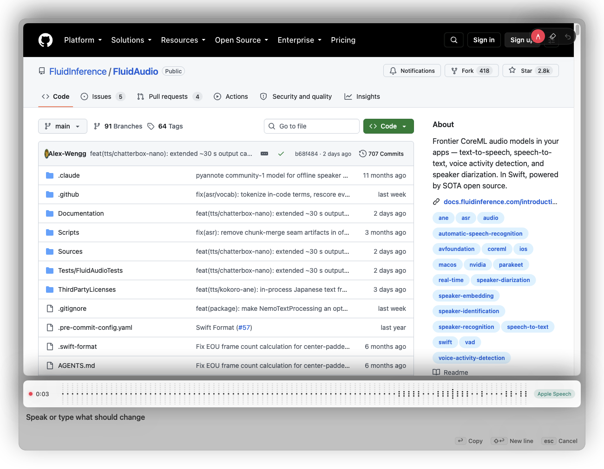

<p align="center">
  
</p>

<p align="center">
  <b>Press ⌘⇧S, drag over the problem, say what should change, press ↩.</b><br>
  The marked-up screenshot and your note land on the clipboard, ready for Claude Code, Codex or any chat.
</p>

<p align="center">
  
</p>

## What it does

Capipaste is a small macOS menu-bar app for giving visual feedback to coding agents.

- **Setup** — the menu bar walks you through the permissions macOS needs (Screen Recording, Microphone, plus Accessibility for dictation) and hides itself once they're granted.
- **Settings** — a window (⌘, from the menu, and on first launch) for shortcuts, hold-to-talk key, microphone, models, permissions and updates.
- **Dictate** — hold **right ⌘**, say it, let go. A bar shows the words as they land; the text goes on the clipboard and pastes into whatever you were typing in. No screenshot involved. (Hold-to-talk and auto-paste need Accessibility.)
- **Capture** — ⌘⇧S opens the native macOS region picker (Space switches to window capture, Esc cancels).
- **Talk** — a card pops up with the screenshot and starts listening. Speech is transcribed **on your Mac**; nothing is uploaded.
- **Mark it up** — pen, arrow, box and **blur** (pixelates secrets or patient details before anything leaves your screen). The eraser removes just the part under it, undo per stroke. Pinch or ⌘+ / ⌘− to zoom, two-finger scroll to pan.
- **Several screenshots, one note** — press ⌘⇧S again while the card is open to add another region (before/after, two places at once). Thumbnails switch between them; recording keeps going.
- **Clips** — ⌃⌘S records a region with the native macOS video picker (up to 30 s). The first frame opens in the card to draw on; the note carries the `.mov` plus frames from through the clip, so agents that can't watch video still see what happened.
- **Reads the screen** — the text in your screenshot is read on your Mac (Apple Vision) and pasted under your note, so a terminal agent sees the error message, not just a file path.
- **Tidy** — turns "um so the uh button, no wait, the header…" into one clear instruction, on-device: Apple's Foundation Models when Apple Intelligence is on, otherwise a downloadable Qwen 3.5 2B (MLX). A rewrite that drops a number or wanders off is thrown away and your own words are used.
- **Your words** — add project names and code terms (`useEffect`, `Supabase`) in Settings; Nemotron is biased toward them and the transcript is spelled right. Names read off the screenshot are added for that capture automatically.
- **Context** — the note says where you were: app, window title and, in Safari/Chrome/Arc/Brave/Edge, the page URL.
- **History** — every note is saved next to its PNG. The menu lists recent captures to copy again, and ⌃⌘V pastes the last one where you are.
- **Never lose a take** — if the transcript fails or comes back empty while you were talking, it retries once, then keeps the card open and asks you to say it again. Typing takes over from dictation so speech never overwrites your edits.
- **Paste** — ↩ copies the annotated PNG and your note, hands focus back to the app you captured from, and closes. The PNG is also saved to `~/Pictures/Capipaste`, and the note ends with its path:

  ````
  The Upgrade button overlaps the nav on mobile; pin the header and give it 16px of room.

  Context: Safari — "Pricing – Acme" — http://localhost:3000/pricing

  Text in the screenshot:
  ```text
  Upgrade to Pro
  ```

  [screenshot: /Users/you/Pictures/Capipaste/Capipaste 2026-09-17 at 01.14.53.png]
  ````

<p align="center">
  
</p>

### Where the paste goes

| You pressed ⌘⇧S from… | Clipboard gets | Why |
|---|---|---|
| A terminal (cmux, Ghostty, Terminal, iTerm2, Warp, WezTerm, kitty, Alacritty, Terax, Rio, Hyper) | Note + screen text + image path | Claude Code attaches a clipboard image and drops the text; the path lets it open the image instead. |
| Anything else (Codex, chat apps, docs) | PNG **and** note | Each app takes what it supports. |

After ↩ Capipaste hands focus back to the app you started from, so ⌘V lands there.

If transcription fails or comes back empty while you were talking, Capipaste retries once. If that fails too, the card stays open and asks you to say it one more time.

### Updates

Capipaste checks GitHub releases and can install them itself if you turn that on in Settings (an automatic install only accepts a build signed with the same identity). Cut one with:

```sh
scripts/release.sh 0.2.0 "What changed"   # builds, then uploads Capipaste.dmg + Capipaste.app.zip
```

### Website

The landing page and FAQ live in their own repo: [Chordlini/capipaste-site](https://github.com/Chordlini/capipaste-site). `brand/make.sh` refreshes its copies of the artwork when they sit side by side.

## Speech models

Pick a model and microphone from the menu bar. Models download on demand (via [FluidAudio](https://github.com/FluidInference/FluidAudio), CoreML on the Neural Engine) and can be deleted from the same menu.

| Model | Released | Best for |
|---|---|---|
| **Nemotron 3.5 Streaming** (default) | Jun 2026 | Live text while you talk |
| Parakeet TDT-CTC 110M | Mar 2026 | Fastest, English only (~450 MB) |
| Cohere Transcribe | Mar 2026 | Most accurate, slower (1.8 GB) |
| Apple Speech | built in | No download; used until another model is on disk |

## Keyboard

| Key | Action |
|---|---|
| ⌘⇧S | Capture (again while the card is open: add a shot) |
| ⌃⌘S | Record a clip |
| ⌃⌘V | Paste the last capture again |
| hold right ⌘ | Dictate (configurable) |
| ↩ | Stop, transcribe, copy, close |
| ⇧↩ | New line in the note |
| Esc | Cancel |
| D / A / B / X / E | Pen / arrow / box / blur / erase |
| ⌘Z | Undo |
| ⌘+ / ⌘− / ⌘0 | Zoom in / out / reset |

Typing in the note stops listening, so dictation never overwrites your edits.

## Install

Requires an Apple Silicon Mac on macOS 26.

**Download** — grab [**Capipaste.dmg**](https://github.com/Chordlini/capipaste/releases/latest/download/Capipaste.dmg), open it and drag Capipaste into Applications.

This build isn't notarized yet, so the first launch is blocked: open **System Settings › Privacy & Security**, scroll down and click **Open Anyway**. You only do this once.

**Or in one line** — skips the Gatekeeper step and launches the app:

```sh
curl -fsSL https://raw.githubusercontent.com/Chordlini/capipaste/main/scripts/get.sh | sh
```

On first launch Capipaste opens Settings and walks you through **Microphone**, **Screen Recording** and (for hold-to-talk) **Accessibility**.

### Build from source

Needs Xcode 27 and [XcodeGen](https://github.com/yonaskolb/XcodeGen).

```sh
git clone https://github.com/Chordlini/capipaste.git
cd capipaste
./scripts/install.sh      # builds Release and installs /Applications/Capipaste.app
```

`project.yml` signs with an Apple Development identity so macOS keeps permissions across rebuilds — change `DEVELOPMENT_TEAM` to your own team ID.

## Project layout

```
Capipaste/
  App.swift          menu-bar app, ⌘⇧S hotkey, capture, terminal detection
  CaptureCard.swift  floating panel + card model (recording, drawing, zoom, submit)
  CardView.swift     the card UI
  Waveform.swift     dot-matrix level meter
  Recorder.swift     microphone list (Core Audio) and 16 kHz capture
  STT.swift          model catalog, downloads, transcription with retry
  Output.swift       strokes, arrows, boxes and blur onto the PNG; saves; writes the clipboard
  OCR.swift          reads the text in a capture (Vision)
  Tidy.swift         on-device note rewrite (Foundation Models, Qwen 3.5 2B via MLX)
  Vocabulary.swift   your words: speech biasing and spelling fixes
  CaptureContext.swift  app, window title and browser URL
  History.swift      saved notes, recent captures, paste last
  Clip.swift         screen recordings and their key frames
checks/
  main.swift         vocabulary self-check (run line at the top)
brand/
  BRAND.md           brand bible: palette, type, the dither engine, motion
  make-art.swift     the engine (icon, mark, dot map, loops, banners, steps)
  assets/            generated brand assets
design/
  mockup.html        app UI reference
scripts/
  install.sh         build + install locally
  release.sh         build, DMG + zip, GitHub release
  get.sh             one-line installer from the latest release
```

### Test hooks

For checking the app without clicking through it (results go to `~/Library/Logs/Capipaste.log`):

```sh
open -n /Applications/Capipaste.app --args -autocapture 200,150,1000,600 -autosubmit   # capture a fixed rect, draw, erase, zoom, submit
open -n /Applications/Capipaste.app --args -demo design/sample-shot.png -snapshot /tmp/card.png
open -n /Applications/Capipaste.app --args -sttfile speech.aiff                         # transcribe a file with the active model
open -n /Applications/Capipaste.app --args -setupdemo -menushot /tmp/menu.png            # render the menu, with the setup steps unmet
open -n /Applications/Capipaste.app --args -demo a.png -addshot b.png -autosubmit -note "typed note"   # two shots, typed note
open -n /Applications/Capipaste.app --args -autoclip 100,100,500,300 -autosubmit           # 3 s clip of a fixed rect
open -n /Applications/Capipaste.app --args -tidy "um so the button, uh, it's grey" -tidydownload   # rewrite one note
open -n /Applications/Capipaste.app --args -recopy                                          # put the last capture back on the clipboard
```

### Brand and artwork

Every mark, banner and animation comes from one Swift script; the palette, type, motion and usage rules live in [`brand/BRAND.md`](brand/BRAND.md).

```sh
brand/make.sh    # rebuilds all brand assets, the app icon and the site copies
```

## License

MIT. Speech runs on [FluidAudio](https://github.com/FluidInference/FluidAudio) (Apache-2.0); global hotkey by [KeyboardShortcuts](https://github.com/sindresorhus/KeyboardShortcuts) (MIT).
