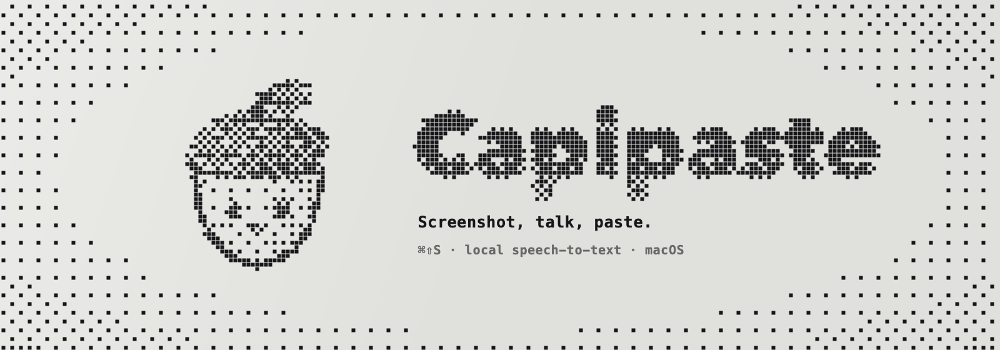

<p align="center"></p>

# Capipaste brand bible

Everything the brand is made of lives in this folder: one drawing engine, the assets it produces, and the rules below. Nothing is hand-drawn in a design tool, so any asset can be rebuilt at any size:

```sh
brand/make.sh          # rebuilds every asset, the app icon and the website copies
```

---

## 1. The idea

Capipaste is a small Mac app you talk to. The brand should feel like **a device, not a dashboard**: a grey e-ink panel, black ink dots, keys you can press. Friendly, never cute-by-default; technical, never cold.

**Voice** — plain, short, second person. Say what a thing does, not how clever it is. "Screenshot. Say it. Paste it." Never "effortlessly supercharge your workflow".

---

## 2. The mark: a dithered acorn

A round, smiling acorn with a crosshatched cap, a stubby stem and one leaf. Capipaste stores things away for later, like an acorn — and "capi" sits in both words.

| Asset | File | Use |
|---|---|---|
| App icon | `assets/acorn-icon.png` | macOS icon: acorn on grey paper in a rounded square |
| Bare mark | `assets/acorn-mark.png` | The acorn alone on transparency, for anywhere that isn't an app icon |
| Dot map | `assets/acorn-dots-56.json` | 39 × 30 grid of `0`/`1` rows, for drawing the mark crisply in code at small sizes |
| Turning loop | `assets/acorn-spin.gif` | Hero animation: turns in place, talks, blinks (4 s loop, transparent) |
| Talking loop | `assets/acorn-talk.gif` | Same face, no rotation; for small spots like a footer |

**Rules**
- Never re-colour the mark. Black ink on grey paper or on transparency.
- Never place the bare mark inside a card, badge or circle. The icon is the only framed version.
- Never scale a big dithered PNG down to a small size: the dots alias and the face falls apart. Below ~64 px, draw from the dot map (see §6).
- Keep the face. The eyes and smile are the brand; a plain acorn is not.

---

## 3. Colour

| Token | Hex | Where |
|---|---|---|
| Paper | `#F1F1EE` | Page background |
| Panel | `#E3E3DF` | Cards, wells, the icon's paper |
| Panel deep | `#D9D9D4` | Placeholder blocks inside mockups |
| Ink | `#17171A` | Text, dots, key caps |
| Ink 2 | `#4A4A50` | Body copy |
| Ink 3 | `#8A8A8F` | Labels, legends, captions |
| Mark red | `#FF3B5C` | **Only** the pen: annotation strokes in the app and on the site |
| Glacier | `#3DD9C1` dark / `#0A8F7E` light | App interface only (waveform accent, chips) — never on the website |

That is the whole palette. The red is a tool, not decoration: if it isn't a drawn annotation, it isn't red.

---

## 4. Type

- **Hanken Grotesk** — everything on the website. 700 for headings (tight, −0.04em), 400/500 for body.
- **JetBrains Mono** — only where the product itself is text: key caps, pasted output, file paths, section numbers.
- **System font (SF)** — inside the macOS app.
- Headline case is sentence case with full stops: "Small app. Every edge filed down."

---

## 5. The dither engine

`make-art.swift` is the whole visual system. Shapes are drawn in greyscale onto a coarse dot grid, then each cell is turned into an ink dot or left blank with an ordered (Bayer 4×4) threshold, and finally printed as square dots.

```
shape → low-res greyscale → Bayer threshold → square ink dots on paper
```

Modes:

```sh
swift make-art.swift icon   out.png 1024
swift make-art.swift mark   out.png 1024                 # acorn only, transparent
swift make-art.swift dots   out.json 56                  # dot map for code-drawn logos
swift make-art.swift talk   out.gif 320                  # talking + blinking loop
swift make-art.swift talk   out.gif 1040 --spin          # also turns in place
swift make-art.swift banner out.png 1600 560 "Title" "Subtitle" "caption"
swift make-art.swift steps  out.png 1600 520             # 1 ⌘⇧S · 2 talk · 3 ↩
```

Shared rules inside the engine:
- **Dot pitch** ≈ 7.3 px per dot at 1024, and dots are square with a ~14% gap.
- **Vignette**: paper darkens toward the edges so borders dissolve into sparse dots instead of ending in a hard line.
- **Shading is what dithers.** Flat fills give flat dot fields; gradients are what make the cap, nut and letters read as volume.
- **Pictograms** (capture, waveform, clipboard) are drawn with anti-aliasing off so they stay crisp on the coarse grid.

---

## 6. The engine on the web (`site/common.js`)

The same look, drawn in the browser:

- `ditherInto(canvas, paint, { cell, color, threshold })` — paints greyscale at low resolution, then prints dots. Pass `threshold` for solid artwork (headlines, wordmarks) and leave it out for shaded artwork (icons, bubbles).
- `drawTitles()` — section headings: the real text stays in the page (transparent) so layout, wrapping, selection and screen readers keep working; the dots are drawn over it. Redrawn on resize and zoom.
- `drawLogos()` — draws the mark from the dot map with every dot snapped to whole device pixels, and redraws when the zoom changes. This is why the logo never breaks at odd zoom levels.
- Bubbles in the closing section, and the e-ink "refresh" flash on the hero, use the same dither.

**Sizing dots**: about one dot per 15–21 px of cap height. Fewer dots per letter looks broken; more looks like grey noise.

---

## 7. Keys

The interface language is a Mac keyboard.

- Key caps: 10 px radius, 1.5 px ink outline, a solid ink edge underneath (`0 5px 0`), sitting 3 px raised.
- Pressed = move down and remove the edge. Hover = halfway.
- Apple legends: symbol above label, aligned to the side the real key uses — **⇧ FAQ** left, **↩ Get Capipaste** right.
- Shortcut hints in body text use the same cap, one letter per cap: <kbd>⌘</kbd><kbd>⇧</kbd><kbd>S</kbd>.

---

## 8. Motion

One idea per moment, and everything stops for `prefers-reduced-motion`.

- **Hero**: e-ink refresh on load (ink flash → paper flash → dots settle), then a slow float, and a drift up on scroll.
- **Headings**: print in through a dither mask as they enter view.
- **Demo**: driven by scroll position, never on a timer.
- **Bubbles**: slow rise with a slight sway, fading out toward the top.
- Nothing bounces, nothing slides in from the side, no fade-up on every section.

---

## 9. Folder map

```
brand/
  BRAND.md              this file
  make.sh               rebuild everything
  make-art.swift        the engine
  assets/               icon, mark, dot map, loops, banner, social, steps
  archive-explorations/ rejected directions (sea-goat logo, Nokia-LCD UI)
  archive-backups/      the spin loop before the rim fix, and its engine
site/                   the website (style.css tokens mirror §3)
design/                 app UI mockups (mockup.html) and sample screenshots
docs/                   screenshots used by the README
```

## 10. Quick don'ts

- Don't add a colour.
- Don't set headlines in the mono font, or body text in dots.
- Don't put the acorn on a coloured or photographic background.
- Don't animate two things at once in the same view.
- Don't fake the dithering with a texture overlay — regenerate it from the engine.
